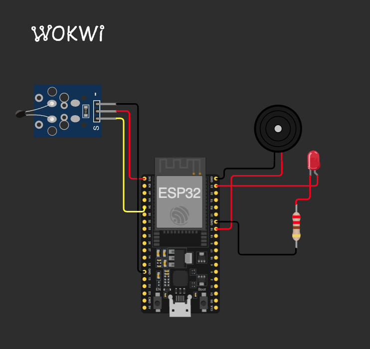

# Sistema de Monitorização e Alarme de Temperatura com Resposta Gradual

> **Projeto Prático de Sistemas Embarcados (ESP32)**  
> _Monitoramento contínuo de temperatura com sensor NTC, resposta visual gradual via PWM em LED e alarme sonoro contínuo com buzzer para condições críticas._

## Contexto Acadêmico

Este repositório contém a solução desenvolvida para a **atividade prática proposta pelo professor**. O objetivo do exercício foi criar um sistema de monitoramento térmico utilizando o simulador **Wokwi** com microcontrolador **ESP32**, consolidando os seguintes conceitos obrigatórios da disciplina:

- Leitura analógica no ESP32 com resolução de 12 bits (ADC1 no GPIO 34, faixa de 0 a 4095).
- Conversão da leitura para graus Celsius (°C) via Equação Beta do termistor NTC.
- Modularização do código-fonte em funções bem definidas e de responsabilidade única para estruturar o programa.
- **Desafio Técnico:** Implementação de resposta visual proporcional contínua via PWM no LED vermelho entre 25.0 °C e 60.0 °C, e acionamento contínuo de buzzer com notificação serial a partir de 70.0 °C.

## 1. O Problema e o Contexto Operacional

Salas de equipamentos críticos e ambientes industriais exigem monitoramento térmico preventivo para evitar paradas não planejadas. Sistemas com alarmes puramente binários não transmitem a percepção gradual de aquecimento aos operadores antes do ponto de emergência.

Este projeto fornece uma camada de monitoramento automatizada que afere continuamente a temperatura via sensor NTC. Em condições normais (< 25.0 °C), os atuadores ficam inativos. Ao aquecer (25.0 °C a 60.0 °C), o LED vermelho acende progressivamente via PWM de 0 a 255 (a meia luz em 42.5 °C). A partir de 70.0 °C, o sistema aciona o alarme sonoro contínuo no buzzer e transmite a mensagem de emergência na porta serial.

## 2. Matriz de Estados e Regras de Disparo

A classificação da temperatura medida pelo sensor rege o comportamento dos atuadores visuais e sonoros de forma determinística:

| Condição Térmica        | Faixa de Temperatura ($T$)                        | Estado do Sistema   | LED Vermelho (GPIO 23 PWM) | Brilho do LED (%) |  Buzzer (GPIO 19)   | Transmissão Serial                |
|:------------------------|:--------------------------------------------------|:--------------------|:--------------------------:|:-----------------:|:-------------------:|:----------------------------------|
| **Normal**              | $T < 25.0^\circ\text{C}$                          | `Normal`            |             0              |  0.0% (Apagado)   |      Desligado      | Telemetria contínua               |
| **Alerta Proporcional** | $25.0^\circ\text{C} \le T \le 60.0^\circ\text{C}$ | `ProportionalAlert` |          0 a 255           |   0.0% a 100.0%   |      Desligado      | Telemetria contínua               |
| **Aquecimento Elevado** | $60.0^\circ\text{C} < T < 70.0^\circ\text{C}$     | `ElevatedWarning`   |            255             |  100.0% (Máximo)  |      Desligado      | Telemetria contínua               |
| **Crítico / Alarme**    | $T \ge 70.0^\circ\text{C}$                        | `CriticalAlarm`     |            255             |  100.0% (Máximo)  | **ATIVO (1000 Hz)** | `! ALERTA: TEMPERATURA CRÍTICA !` |

> [!NOTE]
> **Comportamento Gradual e Retorno Térmico:** O alarme acústico permanece ativo enquanto a temperatura for igual ou superior a 70.0 °C, sendo desativado imediatamente ao resfriar abaixo deste limiar. Abaixo de 60.0 °C, o brilho do LED diminui linearmente até apagar totalmente ao atingir menos de 25.0 °C.

## 3. O Desafio Técnico: Resposta Proporcional (PWM) e Modelagem NTC

Para fornecer percepção visual intuitiva do aquecimento antes do alarme crítico, o firmware converte o sinal do termistor e modula o brilho do LED via modulação por largura de pulso:

- **Conversão de Temperatura (Equação Beta):** A relação de resistência e temperatura absoluta em Kelvin ($T_K$) utiliza a formulação simplificada de Steinhart-Hart com $\beta = 3950\text{ K}$ e $T_0 = 298.15\text{ K}$:

$$\frac{R}{R_0} = \frac{1}{\frac{4095}{\text{ADC}} - 1}, \quad \frac{1}{T_K} = \frac{1}{T_0} + \frac{1}{\beta} \ln\left(\frac{R}{R_0}\right), \quad T(^\circ\text{C}) = T_K - 273.15$$

- **Interpolação Linear do PWM:** O duty cycle do LED vermelho no pino GPIO 23 é calculado linearmente entre 25.0 °C e 60.0 °C:

$$\text{PWM} = \left(\frac{T - 25.0}{60.0 - 25.0}\right) \times 255 = \left(\frac{T - 25.0}{35.0}\right) \times 255$$

- **Disparo de Emergência:** A partir de 70.0 °C, o LED permanece em 100% (PWM 255), o buzzer emite tom contínuo de 1000 Hz e a mensagem `! ALERTA: TEMPERATURA CRÍTICA !` é transmitida na console serial.

## 4. Pinout e Conexões do Circuito (Hardware)

O circuito foi desenvolvido para o **ESP32-DevKitC V4**, mantendo o mapeamento direto de pinos:

| Componente                | Pino ESP32 | Tipo de I/O       | Função no Sistema                   | Montagem Wokwi                             |
|:--------------------------|:-----------|:------------------|:------------------------------------|:-------------------------------------------|
| **Sensor de Temp. (NTC)** | `GPIO 34`  | Entrada Analógica | Leitura de temperatura (ADC 12-bit) | VCC em 3V3, GND em GND e OUT no GPIO 34    |
| **LED Vermelho**          | `GPIO 23`  | Saída PWM         | Alerta visual gradual (0 a 255)     | Ânodo no GPIO 23; Resistor 220 Ω no cátodo |
| **Buzzer Piezoelétrico**  | `GPIO 19`  | Saída Digital     | Alarme acústico contínuo (1000 Hz)  | Positivo no GPIO 19 e Negativo no GND      |

### 4.1. Diagrama do Circuito no Wokwi

Abaixo está a montagem desenvolvida para simulação no Wokwi, demonstrando as conexões do sensor NTC e dos atuadores:

> [!TIP]
> Durante a simulação no Wokwi, clicar sobre o sensor de temperatura NTC abre a barra deslizante (_slider_), permitindo variar a temperatura e observar o LED acendendo progressivamente até 60 °C e o buzzer disparando ao atingir 70 °C.
